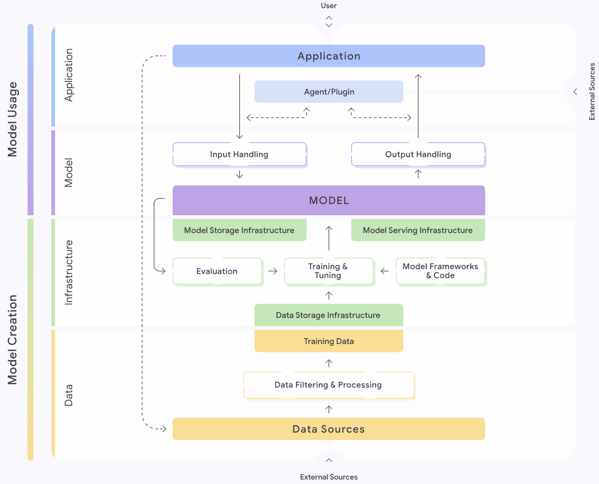

# Google Secure AI Framework (SAIF) Risk Map

Welcome to the **Google Secure AI Framework (SAIF) Risk Map**. This project provides a framework for identifying, analyzing, and mitigating security risks in Artificial Intelligence systems. The goal is to create a shared understanding and a common language for discussing and addressing the unique security challenges of the AI development lifecycle.

---

## About The Project

Traditional software security practices are not always sufficient for AI systems. The introduction of large datasets, complex training processes, and new user interaction models creates a different set of vulnerabilities. 

The SAIF Risk Map addresses this by providing a structured map of the AI security landscape.

The Risk Map is broken down into four key areas:

* **Components**: The fundamental building blocks of an AI system, from data sources to the final application.
* **Risks**: The potential security threats that can affect these components, such as Data Poisoning or Model Evasion.
* **Controls**: The security measures that can be implemented to mitigate these risks.
* **Personas**: The key roles in the AI ecosystem, namely the `Model Creator` and the `Model Consumer`.

## Quickstart

### Project Structure

The framework is organized into a set of YAML files for easy reading and JSON schemas for validation and tooling.

* **Data Files (`.yaml`)**: These files contain the core content of the risk map.
    * yaml/
        * `components.yaml`: The components of an AI system.
        * `risks.yaml`: A catalog of AI security risks.
        * `controls.yaml`: A list of security controls.
        * `personas.yaml`: Definitions of the primary personas.
        * `self-assessment.yaml`: Security self-assessment questionnaire based on this framework.
* **Schema Files (`.schema.json`)**: These files define the structure for the associated YAML files.
    * schemas/
        * `components.schema.json`, `risks.schema.json`, etc.
* **SVG File (`.svg`)**: SVG format files
    * svg/
        * `map.svg`: Graphical representation of the AI system components defined in `components.yaml`

### How to Use

You can use these files to:
* **Learn**: Read the `.yaml` files to understand the landscape of AI security risks.
* **Assess**: Use the framework as a guide for security reviews of your AI projects.
* **Build**: Leverage the `.schema.json` files to expand the framework to address your organization's risk management and governance needs.
   * See [docs/developing.md](./docs/developing.md) for more details. 

## Background
Building and using AI systems involves many potential risks. We created the Securing AI Framework to help manage these risks by tackling several foundational challenges. The industry needed:

* **A common language:** The lack of a shared vocabulary for AI risks created significant confusion, making it difficult to consistently track, discuss, and mitigate threats. For example, the technique of tricking a large language model into unintended behavior through carefully crafted inputs might be described as prompt injection, instruction hijacking, prompt hacking, or more broadly jailbreaking. The threat of intentionally corrupting training data to compromise the model might be called data poisoning, training data attacks, backdoor injection via data, or data contamination. 

* **A clear picture:** Without a shared mapping of the entire AI system, it was difficult to understand how components connected or anticipate where risks might arise. This kept security discussions abstract, hindering the ability to pinpoint specific vulnerabilities and collaborate on defenses. 

* **More focus beyond the model:** An overemphasis on the model and model-centric threats like prompt injection and model theft often obscured significant risks across the broader AI ecosystem, including threats to data pipelines, infrastructure, and deployment processes. We needed a holistic framework capable of identifying risks throughout the entire system, not just within the isolated model.

To address these needs, we developed the Securing AI Framework Map, with supporting documentation about the components, risks, and controls. 

To help practitioners more easily navigate the Map and documentation most relevant to them, we also created the Securing AI Risk Assessment, which gives users personalized risk information after they answer a few questions. 

## Design
The Securing AI Map structures the AI development lifecycle into four primary groupings of components, providing a standardized view of the end-to-end process: **Data, Infrastructure, Model,** and **Application**. Practitioners can understand the processes and components involved in creating and using AI models, and more specifically, which risks are involved in the lifecycle at which stage. 

The visualization uses a top/bottom division. The bottom half details the model creation lifecycle, typically managed by AI development teams (such as data scientists and ML engineers) and the infrastructure that supports that process (storage, serving). The top half covers the process of building model-based applications. This structure clarifies which risks are most relevant to specific organizational roles and responsibilities.

For clarity, the map is simplified to highlight the most critical componenets for understanding the end-to-end AI workflow and key areas of risk. Some components and processes are grouped together based on common risks and controls. For example, different teams may handle model training versus model finetuning at different points in the development lifecycle, but the risks and safeguards during these processes are generally the same. Certain cross-cutting threats, such as supply chain issues affecting artifact integrity, are not depicted individually as they can impact nearly every stage of the lifecycle.

### Key design decisions and tradeoffs

We made several design choices while creating this visualization:

* **Central model representation:** The machine learning model artifact is represented only once, positioned centrally. We considered alternatives, such as showing separate instances for "model in training," "model in storage," and "model in production." However, depicting the model centrally highlights its fundamental role and its direct connection to the surrounding infrastructure.  
* **Placement of storage and serving:** "Model Storage" and "Model Serving" are shown connected beneath the central model artifact. This reflects our view of them primarily as *infrastructure components* supporting the model, rather than distinct sequential steps occurring *after* the model's conceptual finalization. An alternative valid representation could place "Model Serving" sequentially after the model to better illustrate the operational flow. Our chosen layout prioritizes grouping related infrastructure elements together in the “Infrastructure” section of the map.   
* **Simplifying agentic systems:** Agentic systems introduce significant complexity, as they can call other models, which transitively replicates this risk map for each model called. They also introduce intricate interactions between tools, orchestration, and external content. To maintain the main map's clarity, this complexity is consolidated into a single component, with a plan to create a second accompanying diagram that goes into agents in more detail.   
* **A short risk assessment**: For the risk assessment, our top priority was to keep the questionnaire short, so that users could complete it in just a few minutes. We also prioritized having a design that does not save information about people’s answers, while retaining the ability for users to share results.   

### Future directions

1. **Expanding on agents:** The map currently shows a single box representing components for Agents (Agent/Plugins). This needs expansion to show the interplay between an application, a model for reasoning and planning, tools, agentic memory, and other components that allow AI agents to take action.   
2. **Clearer risk-to-control mapping:** The map is a blank canvas that can take overlays of many concepts. A clearer representation of which controls can address each risk would be useful for users. 

This is not an officially supported Google product. This project is not eligible for the [Google Open Source Software Vulnerability Rewards Program](https://bughunters.google.com/open-source-security).
